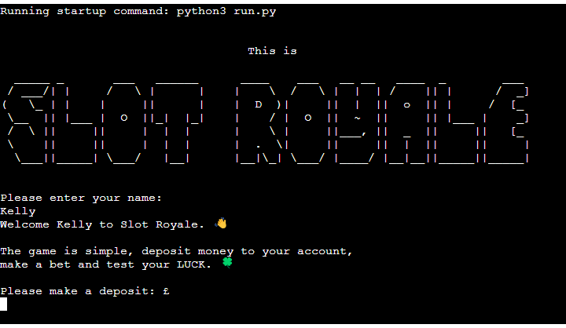
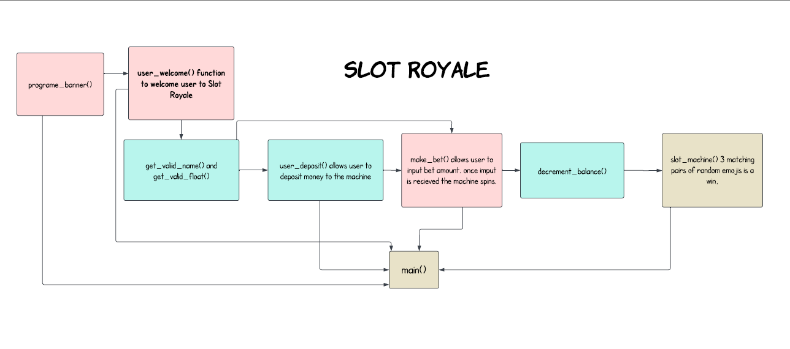

# **Slot Royale**

## Description
Slot Royale is a Command Line Interface **CLI** program that runs in the terminal. The program is a digital slot machine which users can interact with in the terminal. Main functions of the game include allowing the user to make a deposit, place bets and test there luck. Watch the reel spin, and cross those fingers, did you get a JACKPOT!. Simple to use features, where there is no need to worry if you run out of funds, you can top and keep playing. 

## Technology

## Design

[ASCII ART](https://www.ascii-art-generator.org/)

## Program Flow

## Features
  * `program_banner()`
  * `welcome_user()`
  * `user_valid_name()`
  * `user_valid_float()`
  * `user_deposit()`
  * `make_bet()`
  * `decrement_balance()`
  * `slot_machine()`
  * `main()`
  
## Manual Testing

### Validation
[CI Python Linter](https://pep8ci.herokuapp.com/#)

[Python Tutor](https://pythontutor.com/)

## Bugs 
> When the user lost and placed a `new_bet`, the balance was not decrementing to reflect the new bet.

## Deployment 

## Credits

