# **SLOT ROYALE** 🎰

## **Technology**

### Python 3.12 🐍
Supported by Python Built-in Libraries:
1. `random` [Python](https://docs.python.org/3/library/random.html)
2. `os` [Python](https://docs.python.org/3/library/os.html)
3. `time` [Python](https://docs.python.org/3/library/time.html)

## **Description**

Slot Royale is a Command Line Interface (CLI) program that simulates an engaging digital slot machine experience directly in your terminal. Designed with user interaction in mind, this program allows players to immerse themselves in the thrill of gambling without the need for physical machines.

### Key Features:
- 😁 **User-Friendly Interface**: Navigate easily through a simple command-line interface that welcomes you and guides you through the game.
- 🍀 **Deposit and Bet**: Users can make deposits to fund their account and place bets to test their luck on the reels.
- 🤪 **Exciting Gameplay**: Spin the reels and watch as emojis align for a chance to hit the JACKPOT! The game provides immediate feedback on wins and losses.
- 💰 **Top-Up Option**: If you run out of funds, no need to worry. You can easily top up your balance and continue playing without interruption.
- 😲 **Engaging User Experience**: Enjoy a friendly welcome message and clear simple instructions to enhance your gaming experience.

Join the fun with Slot Royale and see if you can strike it rich!

## **User Stories** 📖

#### User's Goals:
1. I want to make a deposit so that I can fund my account and play the slot machine.
2. I want to place a bet so that I can try my luck at winning. I want to see my current balance so that I can manage my funds effectively while playing.
3. I want to choose my bet amount so that I can control how much I risk on each spin.
4. I want to receive feedback on my bets so that I know if I won or lost after each spin.
5. I want to have the option to play again after each round, so I can continue enjoying the game without  restarting the program.
6. I want to be welcomed with a friendly message when I start the game, to enhance my gaming experience.

#### Program Owner Goals:
1. I want to implement a feature to clear the console to enhance the user experience by keeping the interface clean.
2. I want to track user balances accurately to ensure fair play and maintain trust in the game.
3. I want an option that allows the user to continue gameplay, so if their funds hit £0.00 they get a
prompt to top up, make a deposit.
4. I want the program to replicate a spinning reel when the player places a bet, visual effect.

## **Program Flow Chart** 🔄
### Program breakdown
Depicts how the key features, user goals and owner goals are demostrated.

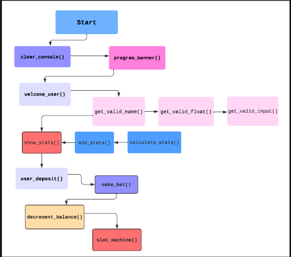

- `clear_console()`clears the console so that the terminal does not get overwelming, visually. This function is called when the player chooses to play again.

- `program_banner()`Displays the game banner.

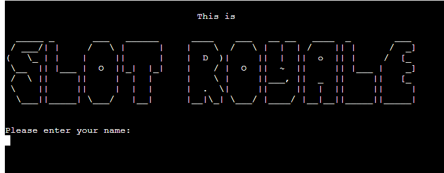

- `welcome_user()`Greets the user and collects their name, providing brief instructions.

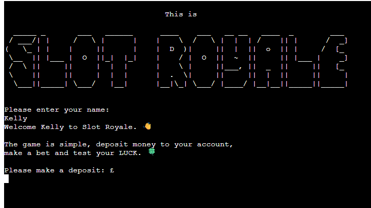

#### Input Validations - Error Handling
please see: **Error Handling - User Input** below

- `user_valid_name()`Validates the users name input, ensure only letters are provided.
- `user_valid_float()`Validates the users input for deposits and bets eg. by accepting either 10 or 10.00.
- `get_valid_input()`Validates uers input for yes and no for play again options either y or n are accepted.

#### Stats Functions
- `add_stats()`
- `calculate_stats()`
- `show_stats`

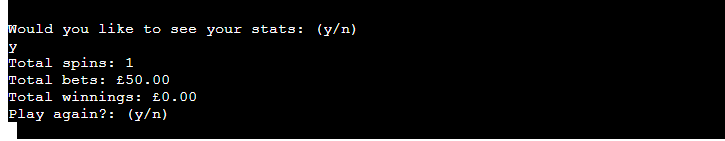

- `user_deposit()`Allows the user to add money to there balance.

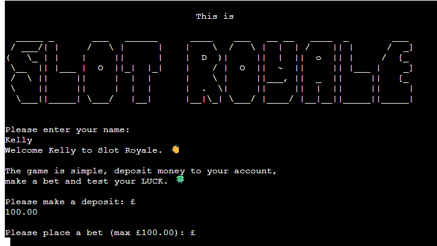

#### Functions, along with the main game `slot_machine` function.
- `make_bet()`Provides the user with an option to place a bet amount.

- `decrement_balance()`ensures the bet amount is taken away from the balance if the user loses a round.
- `slot_machine()`Main game function, runs the slot machine logic.

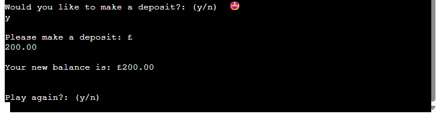
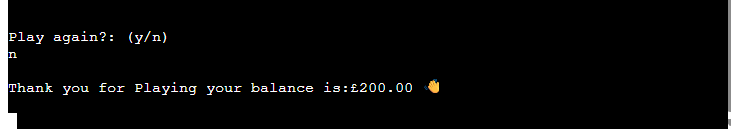

- `main()`Holds all the main function calls in one place.

### Decision Points 🧠
- **Play Again?**: After each round, the user is prompted to play again or exit.
- **Balance Check**: If the balance reaches zero, the user is prompted to deposit more funds.
- **Show Stats**: Allows user to choose if they want see there game stats, this provides awareness of bet amount and winnings, along with game spins.

## **Future Features** 🌟

Some features that I would like to add when I further develop my skills and confidence:

* **Mulitple Game Modes** - as well as having the classic game mode, I would like to add in higher stakes and bigger payouts. I would also like to add in an option for players to compete against each other for a set period of time, with the highest balance winning a prize. 🏆
* **Bonus Rounds** - which can be triggered by combining a specific emoji such as 3 lemons get you a free spin, or 3 stars earns you a higher JACKPOT.
* **Customize Emojis** players get unlock different sets of emojis for the reels.
* **Sound Effects** for when player hit a win, deposit money, place a bet or lose a round.
* **Mobile Compatibility** making a version of the game by optimising the CLI for mobile devices.

## **Validation** 🔍

[CI Python Linter](https://pep8ci.herokuapp.com/#)

> While validating the functionality of my code to ensure it meets the required specifications and performs efficiently. I did not encounter any errors. Please see below, results from my **CI Python Linter**.

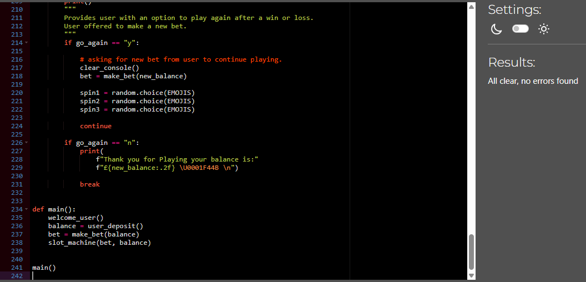

I also used [Python Tutor](https://pythontutor.com/) throughout the development of my program to ensure my code was behaving as it should. It was very useful for debugging, where it allowed me to see if there was any errors in patricular parts of my code, as the python tutor would simple not run specific blocks of code, or even provide incorrect outputs.

## **Manual Testing** ⚙️

### Bugs and Fixes 🦠

> When the user lost and placed a `new_bet`, the balance was not decrementing to reflect the new bet. Bug found where in the code where the `new_balance` was not being updated to reflect the `new_bet` amount.

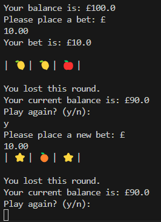

**Code fix where `decrement_balance` function.**.

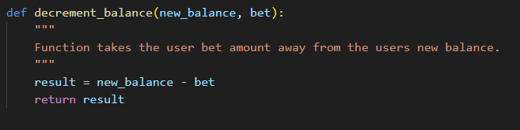

**Function being called correctly within the `slot_machine` function.**.

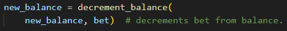

> Bug when user is prompted <em>"Would you like to make a deposit: y/n".</em> When the user typed "y" in this instance, nothing happened. The program should have displayed a message asking the user to top up there balance.

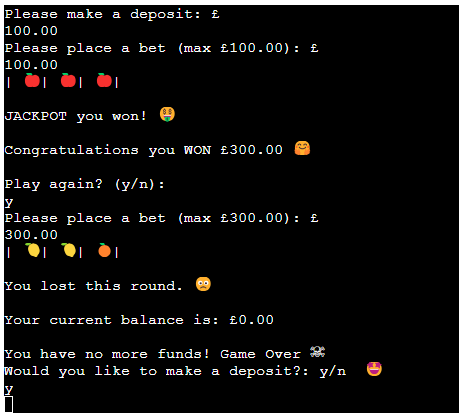

**Bug fix in code where `new_balance += deposit_amount` was not assigned correctly, instead I had wrote `deposit_amount += new_balance`.**

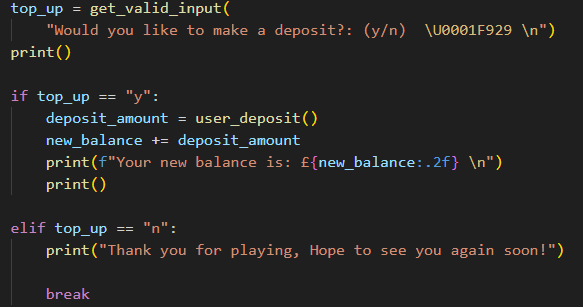

> As depicted in the below image, there is a trailing, `ls...` this bug was left over text from the print statement `print("Spinning the reels...", end="", flush=True)`.

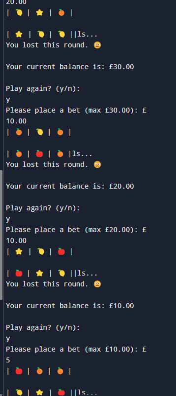

**A empty `print()` statement was added to ensure adequate spacing.**

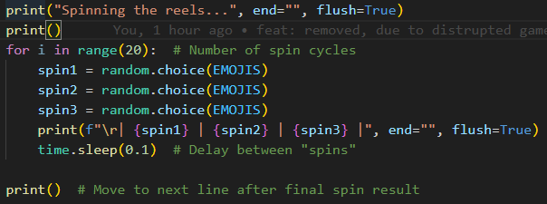

> Duplicated `program_banner` displayed every time a user choose to play again, this would continue to duplicate depending on how many times the user choose to play again, in this case the user only decided to play again once.

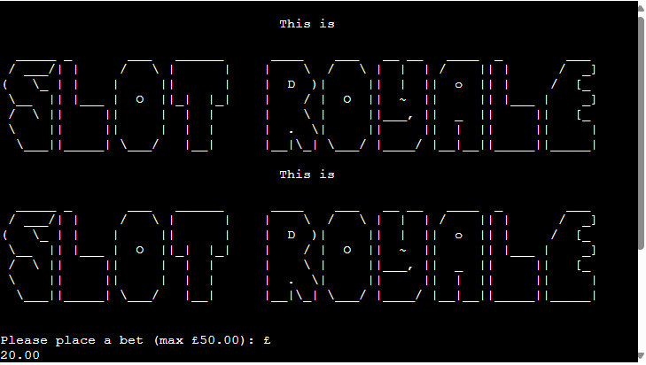

**This bug was fixed by taken `clear_console` and `program_banner` function calls out of the `main()` function and placing them directly under each function as displayed in the image below. This ensured that the `clear_console` function was called at the beginning of the program and that the `program_banner` remained on the top of the program throughout.**

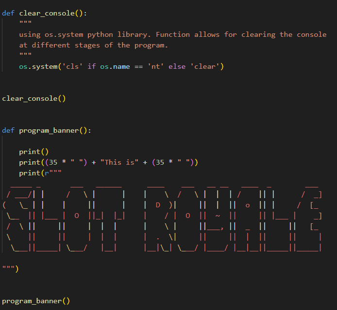

## **Error Handling - User Input**  🔥

* Valid name input:

  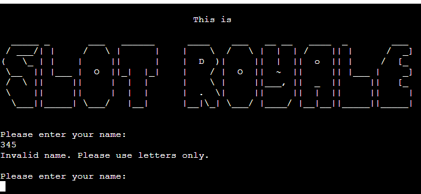

* Valid bet amount: exceeding balance, providing a negative number or letters.

  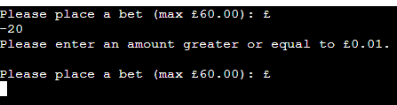

  

  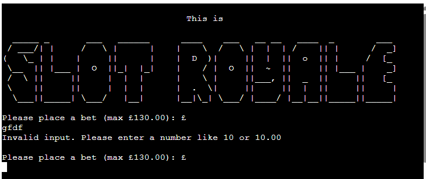

* Valid (y/n) user input: This ensure the correct input, as before this validation was set if the user typed a number the program was treating it as if it was the user placing a bet.

  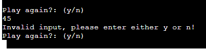

## **Deployment** 🚀

The project was deployed to Heroku using the following steps:

1. Sign in to Heroku and access the dashboard.
2. In the top right corner, click the **"New"** dropdown menu and then click **"Create new app"**.
3. Choose a name for your app, then change your region accordingly.
4. Click **"Create app"**.
5. On the next page that loads after clicking **"Create app"**, click **"Settings"** in the top navigation bar.
6. Click on **"Reveal Config Vars"**.
7. Add a new Config Var: type **'PORT'** in the **'KEY'** section, and type **'8000'** into the **'VALUE'** section, then click **"Add"**.
8. Next, scroll down to the **"Buildpack"** section and click **"Add buildpack"** they must be in order <em>heroku/python</em> then <em>heroku/nodejs</em> after.
9. In the top navigation bar, click the **"Deploy"** tab.
10. In the **"Deployment Method"** section, click on GitHub to connect to your GitHub account.
11. After logging into your GitHub account, search for your GitHub repository name (for this project, it was **"slot-royale"**).
12. Click on the repository once found to connect it.
13. Scroll down to the section **"Automatic Deploys"** and click on the **"Enable Automatic Deploys"** button
Then underneath, make sure the branch for the project is **"main"** and click on the **"Deploy"** button
Wait for Heroku to display that the app was deployed successfully.
1.  You can also choose **"manual deploy"**.

## **Credits** 🎉

[CS50 David J Malan](https://www.youtube.com/@cs50) used to delve further into conditionals, interation and data structures.

[Bro Codez](https://www.youtube.com/@BroCodez) watched tutorials on Python concepts.

[Python Documentation](https://docs.python.org/3.12/) read through Python documentation in relation to `time`, `os`, `random`.

[ASCII ART](https://www.ascii-art-generator.org/) used to generate the program banner.

[Mentor](https://www.linkedin.com/in/hamiltondl/) Daniel Hamilton amazing support and feedback throughout my project. As a speaclist in back-end development Daniel really provided great insight and guidance.

CI Slack Community, and tutors. Provided unwavering support on those days where I felt lost and overwelmed.

[CS50 Duck Debugger](https://cs50.ai/chat) I used this to help me talk through my problem solving.

[Python Complier - programiz](https://www.programiz.com/python-programming/online-compiler/) this was used to test my python program where I ran blocks of code to check for expected functionality.

[Lucid Chart](https://www.lucidchart.com/blog/automate-your-work-with-lucidchart) was used to create a flowchart displaying the over all program flow start to finish.

[BBC Bitesize Revision](https://www.bbc.co.uk/bitesize/subjects/zvc9q6f) used to help revise functions, while also studying algorithms to help with function flow.

[TedEd](https://www.youtube.com/@TEDEd) watched talks on computational thinking to help me with breaking down the logic.

[DEV](https://dev.to/) took inspiration from articles around code structuring and the use of [Conventional Commits](https://www.conventionalcommits.org/en/v1.0.0/).

[W3Schools](https://www.w3schools.com/) engaged in tutorials, particularly around iteration of the reels in the game and also validation code for checking user input.

[Heroku](https://www.heroku.com/) used to deploy the program, deployment steps listed above.

[ChatGBT](https://chatgpt.com/?utm_source=google&utm_medium=paidsearch_nonbrand&utm_campaign=DEPT_SEM_Google_NonBrand_Acquisition_EMEA_Ireland_Consumer_CPA_BAU_Generic-Mix_English&utm_term=online%20chat%20with%20ai&gad_source=1&gbraid=0AAAAA-IW-UWEJG9c98MNsrZ5DfLplivGM&gclid=Cj0KCQjww-HABhCGARIsALLO6XxJzqP6jGUZyuh0kMSxxG4_CTNhhYikT0vTGn3fJeVtPisiBz8iw1IaAsY7EALw_wcB) used to generate readme SLOT ROYALE main image.

[Emoji Charts](https://unicode.org/emoji/charts/full-emoji-list.html) Emoji unicodes where taken from this site, and where used for the slot machine reels and in game visual imagery.