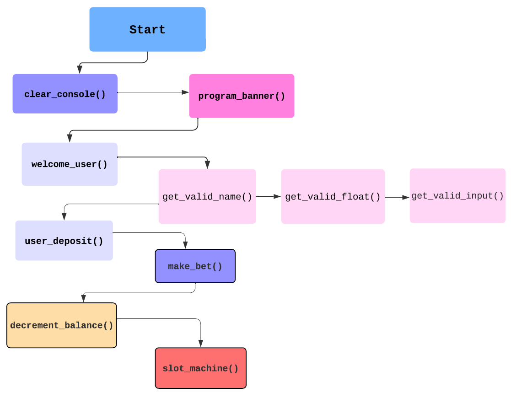

# **SLOT ROYALE** 

## **Technology**

### Python 3.12
Supported by Python Built-in Libraries:
1. `random` [Python](https://docs.python.org/3/library/random.html)
2. `os` [Python](https://docs.python.org/3/library/os.html)          
3. `time` [Python](https://docs.python.org/3/library/time.html) 
                                                                                          

## **Description**

# Slot Royale

Slot Royale is a Command Line Interface (CLI) program that simulates an engaging digital slot machine experience directly in your terminal. Designed with user interaction in mind, this program allows players to immerse themselves in the thrill of gambling without the need for physical machines.

### Key Features:
- **User-Friendly Interface**: Navigate easily through a simple command-line interface that welcomes you and guides you through the game.
- **Deposit and Bet**: Users can make deposits to fund their account and place bets to test their luck on the reels.
- **Exciting Gameplay**: Spin the reels and watch as emojis align for a chance to hit the JACKPOT! The game provides immediate feedback on wins and losses.
- **Top-Up Option**: If you run out of funds, no need to worry. You can easily top up your balance and continue playing without interruption.
- **Engaging User Experience**: Enjoy a friendly welcome message and clear simple instructions to enhance your gaming experience.

Join the fun with Slot Royale and see if you can strike it rich!

## **User Stories**
#### User's Goals:
1. I want to make a deposit so that I can fund my account and play the slot machine.
2. I want to place a bet so that I can try my luck at winning.I want to see my current balance so that I can manage my funds effectively while playing.
3. I want to choose my bet amount so that I can control how much I risk on each spin.
4. I want to receive feedback on my bets so that I know if I won or lost after each spin.
5. I want to have the option to play again after each round, so I can continue enjoying the game without restarting the program.
6. I want to be welcomed with a friendly message when I start the game, to enhance my gaming experience.

#### Program Owner Goals:
1. I want to implement a feature to clear the console to enhance the user experience by keeping the interface clean.
2. I want to track user balances accurately to ensure fair play and maintain trust in the game.
3. I want an option that allows the user to continue gameplay, so if their funds hit £0.00 they get a
prompt to top up, make a deposit.
4. I want the program to replicate a spinning reel when the player places a bet, visual effect.

## Program Flow Chart

- `clear_console()`
- `program_banner()`
- `welcome_user()`
- `user_valid_name()`
- `user_valid_float()`
- `get_valid_input()`
- `user_deposit()`
- `make_bet()`
- `decrement_balance()`
- `slot_machine()`
- `main()`

## Manual Testing

### Validation

[CI Python Linter](https://pep8ci.herokuapp.com/#)

[Python Tutor](https://pythontutor.com/)

## Bugs

> When the user lost and placed a `new_bet`, the balance was not decrementing to reflect the new bet.

## Deployment

## Credits
[ASCII ART](https://www.ascii-art-generator.org/)